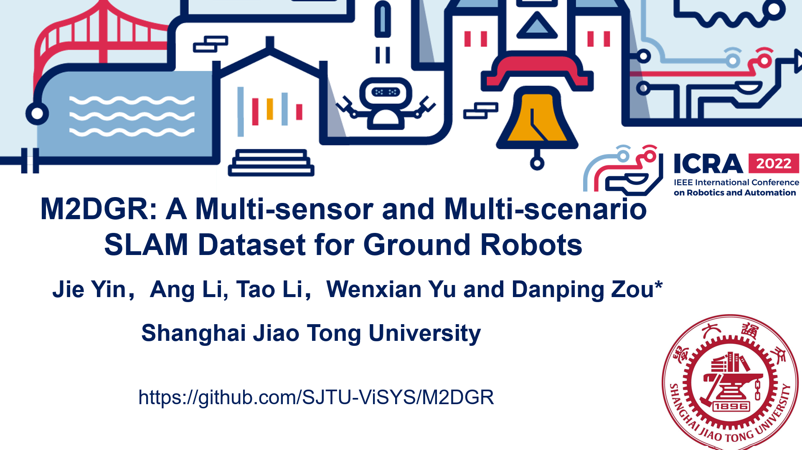

# M2DGR： a Multi-modal and Multi-scenario SLAM Dataset for Ground Robots
## First Author: [Jie Yin](https://github.com/sjtuyinjie?tab=repositories)

Figure 1. Sample Images

## Updates

### 2022.06.20   Thanks Jialin Liu (Fudan University) for his work to test LVI-SAM on M2DGR. Following is the link of their modified LVI-SAM version [link](https://github.com/electech6/LVI-SAM_detailed_comments).  And the configuration files for LVI-SAM on M2DGR are given in [launch file](https://github.com/SJTU-ViSYS/M2DGR/blob/main/module_sam.launch),[camera file](https://github.com/SJTU-ViSYS/M2DGR/blob/main/my_params_camera.yaml) and [lidar file](https://github.com/SJTU-ViSYS/M2DGR/blob/main/my_params_lidar.yaml). Feel free to test the demo on your machine!

LVI-SAM on M2DGR

2022.02.18   We have upload a brand new SLAM dataset with GNSS, vision and IMU information. Here is our link [SJTU-GVI](https://github.com/sjtuyinjie/SJTU_GVI). Different from M2DGR, new data is captured on a real car and it records GNSS raw measurements with a Ublox ZED-F9P device to facilitate GNSS-SLAM. Give us a star and folk the project if you like it.

2022.02.01   Our work has been accepted by ICRA2022!

## NOTICE
### We strongly recommend that the newly proposed SLAM algorithm be tested on our data, because our data has following features:
1. A  rich pool of sensory information including vision, lidar, IMU, GNSS,event, thermal-infrared images and so on
2. Various scenarios in real-world environments including lifts, streets, rooms, halls and so on.
3. Our dataset brings great challenge to existing SLAM algorithms including LIO-SAM and ORB-SLAM3. If your proposed algorihm outperforms SOTA systems on M2DGR, your paper will be much more convincing and valuable.

## ABSTRACT:

We introduce M2DGR: a novel large-scale dataset collected by a ground robot with a full sensor-suite including six fish-eye and one sky-pointing RGB cameras, an infrared camera, an event camera, a Visual-Inertial Sensor (VI-sensor), an inertial measurement unit (IMU), a LiDAR, a consumer-grade Global Navigation Satellite System (GNSS) receiver and a GNSS-IMU navigation system with real-time kinematic (RTK) signals. All those sensors were well-calibrated and synchronized, and their data were recorded simultaneously. The ground truth trajectories were obtained by the motion capture device, a laser 3D tracker, and an RTK receiver.  The dataset comprises 36 sequences (about 1TB) captured in diverse scenarios including both indoor and outdoor environments. We evaluate state-of-the-art SLAM algorithms on M2DGR. Results show that existing solutions perform poorly in some scenarios. For the benefit of the research community, we make the dataset and tools public.

Keywords:Dataset, Multi-model, Multi-scenario,Ground Robot

## MAIN CONTRIBUTIONS:
* We collected long-term challenging sequences for ground robots both indoors and outdoors with a complete sensor suite, which includes six surround-view fish-eye cameras, a sky-pointing fish-eye camera, a perspective color camera, an event camera, an infrared camera, a 32-beam LIDAR, two GNSS receivers, and two IMUs. To our knowledge, this is the first SLAM dataset focusing on ground robot navigation with such rich sensory information.
* We recorded trajectories in a few challenging scenarios like lifts, complete darkness, which can easily fail existing localization solutions. These situations are commonly faced in ground robot applications, while they are seldom discussed in previous datasets.
* We launched a comprehensive benchmark for ground robot navigation. On this benchmark, we evaluated existing state-of-the-art SLAM algorithms of various designs and analyzed their characteristics and defects individually.

## Video

For Chinese users, try 

## LICENSE
This work is licensed under MIT license. International License and is provided for academic purpose. If you are interested in our project for commercial purposes, please contact us on 1195391308@qq.com for further communication. 

If you face any problem when using this dataset, feel free to propose an issue. And if you find our dataset helpful in your research, simply give this project a 
. 

The paper has been accepted by both [RA-L](https://www.ieee-ras.org/publications/ra-l/) and [ICRA 2022](https://icra2022.org/). A preprint version of the paper in [Arxiv](https://arxiv.org/abs/2112.13659) and [IEEE RA-L](https://ieeexplore.ieee.org/document/9664374).If you use M2DGR in an academic work, please cite:
~~~
@ARTICLE{9664374,
  author={Yin, Jie and Li, Ang and Li, Tao and Yu, Wenxian and Zou, Danping},
  journal={IEEE Robotics and Automation Letters}, 
  title={M2DGR: A Multi-sensor and Multi-scenario SLAM Dataset for Ground Robots}, 
  year={2021},
  volume={},
  number={},
  pages={1-1},
  doi={10.1109/LRA.2021.3138527}}
~~~

